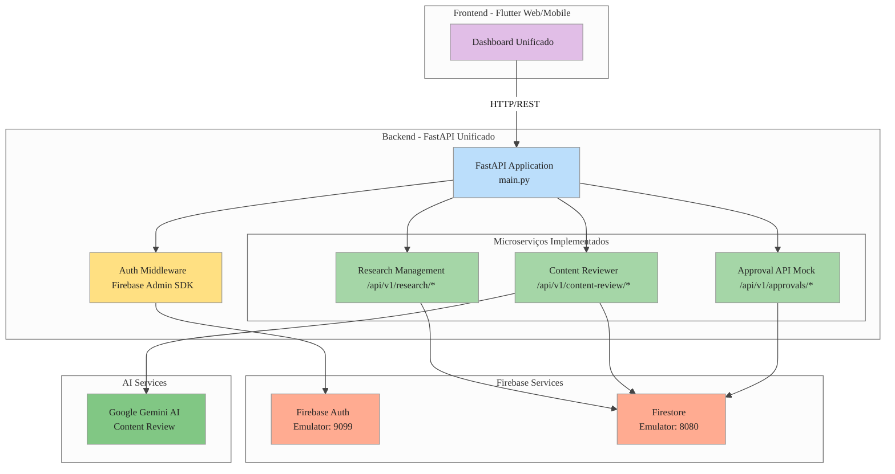
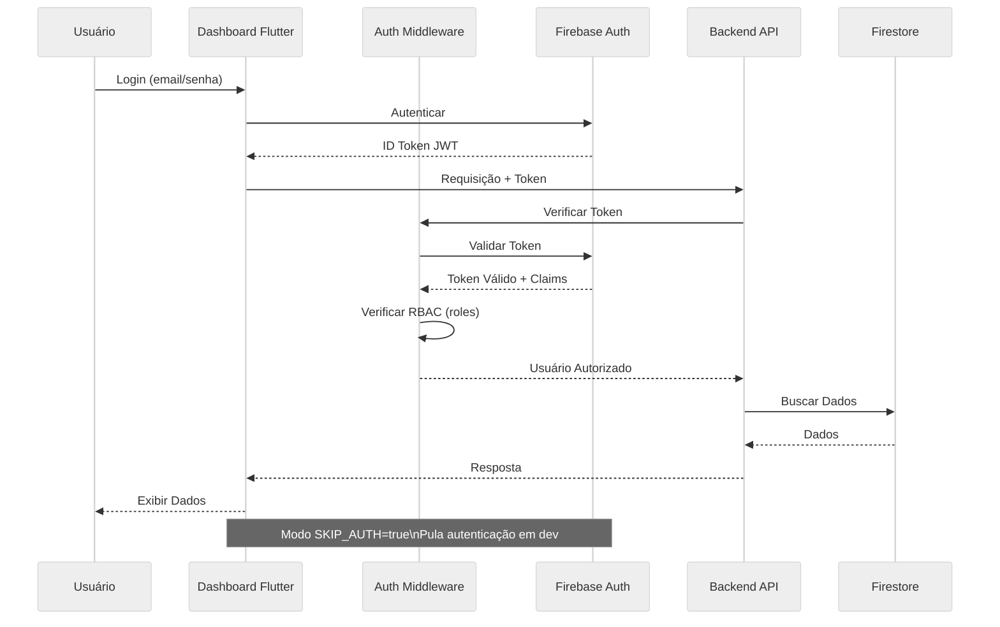
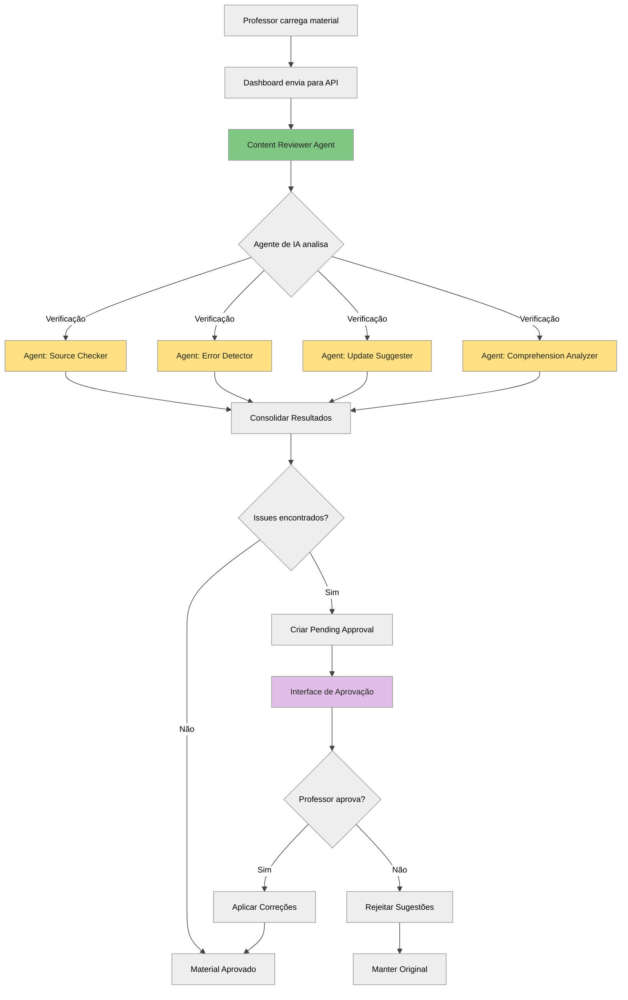
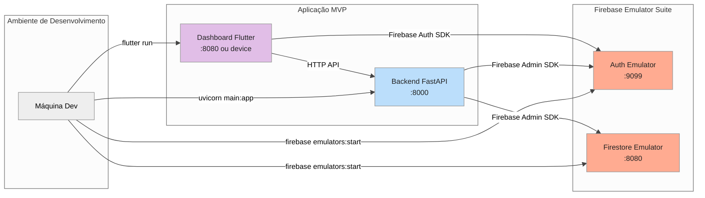
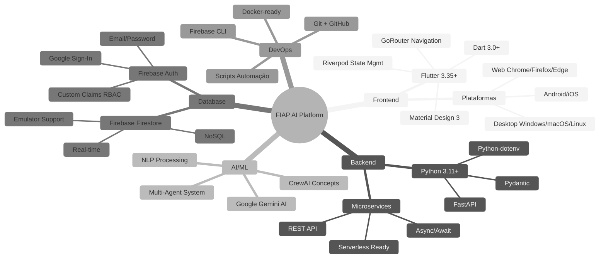

# FIAP - Faculdade de Informática e Administração Paulista

<p align="center">
<a href= "https://www.fiap.com.br/"></a>
</p>

<br>


# FIAP AI-Enhanced Learning Platform - MVP Produção

## Atividade em Grupo: FIAP - 1TIAOB - 2025/2 - GS2

## 👨‍🎓 Integrantes: 
- <a href="">Alice C. M. Assis - RM 566233</a>
- <a href="">Leonardo S. Souza - RM 563928</a>
- <a href="">Lucas B. Francelino - RM 561409</a> 
- <a href="">Pedro L. T. Silva - RM 561644</a> 
- <a href="">Vitor A. Bezerra - RM 563001</a>

## 👩‍🏫 Professores:
### Tutor(a) 
- <a href="proflucas.moreira@fiap.com.br">Lucas Gomes Moreira</a>
### Coordenador(a)
- <a href="profandre.chiovato@fiap.com.br">André Godoi Chiovato</a>

[](https://flutter.dev)
[](https://www.python.org)
[](https://firebase.google.com)
[](https://fastapi.tiangolo.com)

## 🚀 Visão Geral

**FIAP AI-Enhanced Learning Platform** é uma plataforma que utiliza **agentes de IA** e **gamificação** para transformar a experiência educacional na FIAP. O projeto demonstra como a tecnologia pode tornar o trabalho educacional mais **humano, inclusivo e sustentável**.

### 🎯 Objetivo

Responder ao desafio **FIAP Global Solution 2025.2**: *"Como a tecnologia pode tornar o trabalho mais humano, inclusivo e sustentável no futuro?"*

**Nossa resposta**: Utilizando agentes de IA como **assistentes de professores** para automatizar tarefas repetitivas, mantendo controle humano sobre decisões críticas, combinado com **gamificação e acessibilidade** para engajar e incluir todos os estudantes.

---

## ✅ O Que Foi Entregue no MVP

### 📦 Estatísticas do MVP

| Categoria | Implementado | Total | Percentual |
|-----------|--------------|-------|------------|
| **Packages Python** | 3 | 10 | 30% |
| **Packages Flutter** | 6 | 6 | 100% |
| **Total Geral** | 9 | 16 | **56,25%** |
| **Linhas de Código** | ~5.000+ | - | - |
| **Testes Automatizados** | 40+ | - | - |

### 🎯 Funcionalidades Implementadas e Demonstráveis

#### 1. ✅ **Gestão Completa de Iniciação Científica**
- **Package**: `research_management` (Python) + `research_dashboard` (Flutter)
- **O que faz**:
  - Dashboard do coordenador com métricas em tempo real
  - Dashboard do orientador para acompanhamento de orientandos
  - Dashboard do aluno com progresso detalhado
  - Sistema de alertas automatizado (sem orientador, sem atualizações, prazos próximos)
  - API REST completa com CRUD de projetos
- **Tecnologias**: FastAPI, Firebase Firestore, Flutter Riverpod
- **Diferencial**: Promove inclusão garantindo que nenhum aluno fique sem acompanhamento

#### 2. ✅ **Revisão Inteligente de Conteúdo Educacional**
- **Package**: `content_reviewer_agent` (Python) + tela no dashboard
- **O que faz**:
  - Agente de IA que analisa materiais educacionais (PDFs, textos, apresentações)
  - Verificação automática de fontes e referências
  - Detecção de informações desatualizadas
  - Sugestões de melhorias e correções
  - Interface de aprovação humana para aplicar mudanças
- **Tecnologias**: Google Gemini AI, FastAPI, CrewAI concepts
- **Diferencial**: Mantém qualidade de conteúdo sem sobrecarregar professores

#### 3. ✅ **Interface de Aprovação Humana (Human-in-the-Loop)**
- **Package**: `approval_interface` (Flutter)
- **O que faz**:
  - Interface genérica para aprovar/rejeitar ações de IA
  - Filtros avançados por tipo, status, data
  - Operações em lote (bulk approve/reject)
  - Preview detalhado de cada item
  - Dashboard com estatísticas de aprovações
- **Tecnologias**: Flutter, Material Design 3
- **Diferencial**: Garante controle humano sobre todas decisões de IA (ética e transparência)

#### 4. ✅ **Monitoramento de Bem-Estar Estudantil**
- **Package**: `student_wellbeing` (Python + Flutter integrado)
- **O que faz**:
  - Detecção de tendências negativas em saúde mental
  - Check-ins regulares de bem-estar (não invasivos)
  - Alertas precoces para equipe de apoio
  - Dashboard para coordenadores visualizarem alertas
  - Conformidade total com LGPD/GDPR (anonimização, consentimento)
- **Tecnologias**: Flutter Secure Storage, análise de padrões
- **Diferencial**: Promove bem-estar e previne burnout/evasão

#### 5. ✅ **Avaliações Adaptativas com Gamificação**
- **Package**: `adaptive_assessment` (Flutter)
- **O que faz**:
  - Sistema de provas com dificuldade adaptativa (mais fácil/difícil conforme desempenho)
  - Gamificação: pontos XP, níveis, conquistas
  - Acessibilidade total: texto-para-fala, alto contraste, ajuste de fonte
  - Suporte especial para dislexia e outras necessidades
  - Feedback imediato e motivador
- **Tecnologias**: Flutter TTS, gamificação
- **Diferencial**: Inclusão e engajamento de todos os estudantes

#### 6. ✅ **Autenticação e Segurança Completa**
- **Package**: `auth_service` (Python) + `dashboard_auth` (Flutter)
- **O que faz**:
  - Firebase Authentication (email/senha, Google)
  - RBAC - controle de acesso baseado em papéis (coordinator, advisor, student)
  - Middleware de autorização em todas APIs
  - Modo demo sem autenticação para desenvolvimento
  - Suporte a Firebase Emulator para testes locais
- **Tecnologias**: Firebase Admin SDK, Firebase Auth, FastAPI middleware
- **Diferencial**: Segurança enterprise-grade em plataforma educacional

#### 7. ✅ **Sistema de Temas Claro/Escuro**
- **Package**: `tema` (Flutter)
- **O que faz**:
  - Alternância entre tema claro e escuro
  - Persistência da preferência do usuário
  - Detecção automática do tema do sistema
  - Design Material 3 moderno
- **Tecnologias**: SharedPreferences, Material Theme
- **Diferencial**: Acessibilidade e conforto visual

#### 8. ✅ **Aplicação Unificada Pronta para Produção**
- **Localização**: `production/backend` + `production/dashboard`
- **O que faz**:
  - Backend FastAPI único integrando todos microserviços
  - Dashboard Flutter único integrando todas interfaces
  - Scripts automatizados de execução (`run_backend.sh`, `run_dashboard.sh`)
  - Documentação completa de setup e uso
  - Modo desenvolvimento com Firebase Emulator
- **Tecnologias**: FastAPI, Flutter Web, Docker-ready
- **Diferencial**: Deploy simplificado e manutenção centralizada

#### 9. ✅ **Vídeo de Apresentação**
- **Conteúdo**: Apresentação da ferramenta de forma didática e descontraída 
- **Link do vídeo**: https://youtu.be/PzlZoRGiBk0

---

## ⏳ O Que Será Implementado nas Próximas Versões

As seguintes funcionalidades foram **planejadas mas não implementadas** no MVP, ficando para releases futuras:

### Backend Python (7 pacotes pendentes)

1. **Code Review Agent** - Análise inteligente de PRs via GitHub API
2. **Grading Agent** - Correção automatizada de trabalhos com rubricas personalizadas
3. **Award Methodology Agent** - Sistema de premiação transparente e auditável
4. **Content Generator Agent** - Geração de vídeos (Veo3), podcasts (NotebookLM) e materiais
5. **Mental Health Agent** - Análise preditiva avançada de saúde mental (além do wellbeing básico)
6. **Plagiarism Detection Agent** - Detecção semântica de plágio em código e texto
7. **AI Usage Detection Agent** - Identificação de uso excessivo de ferramentas IA

### Infraestrutura e DevOps

- **CI/CD Completo**: GitHub Actions com testes automatizados, linting, deploy
- **Deploy Serverless**: Google Cloud Functions para backend, Firebase Hosting para frontend
- **Terraform/IaC**: Infraestrutura como código para ambientes staging e produção
- **Monitoring**: Application Insights, logs estruturados, alertas
- **Testes de Integração E2E**: Cypress ou Playwright para testes end-to-end

### Integrações Externas

- **GitHub API**: Para Code Review Agent
- **Veo3/Sora**: Para geração de vídeos educacionais
- **NotebookLM**: Para geração de podcasts e resumos
- **Grok/Claude**: Modelos adicionais de LLM

---

## 🏗️ Arquitetura do Projeto

### Diagrama de Estrutura de Pastas

```mermaid
%%{init: {'theme':'neutral','themeVariables': { 'primaryTextColor': '#222','secondaryTextColor': '#222','tertiaryTextColor': '#222','lineColor':'#444','fontSize':'14px','fontFamily':'Inter, Arial, sans-serif'}} }%%
graph TD
    A[fiap_gs2/] --> B[production/]
    A --> C[packages/]
    A --> D[packages_dashboard/]
    A --> E[docs/]
    A --> F[.github/]
    
    B --> B1[backend/]
    B --> B2[dashboard/]
    
    B1 --> B11[main.py]
    B1 --> B12[.env.example]
    B1 --> B13[run_backend.sh]
    
    B2 --> B21[lib/src/]
    B2 --> B22[pubspec.yaml]
    B2 --> B23[run_dashboard.sh]
    
    C --> C1[auth_service ✅]
    C --> C2[research_management ✅]
    C --> C3[content_reviewer_agent ✅]
    C --> C4[grading_agent ⏳]
    C --> C5[code_review_agent ⏳]
    C --> C6[... 5 mais ⏳]
    
    D --> D1[tema ✅]
    D --> D2[dashboard_auth ✅]
    D --> D3[research_dashboard ✅]
    D --> D4[approval_interface ✅]
    D --> D5[adaptive_assessment ✅]
    D --> D6[student_wellbeing ✅]

    style C1 fill:#90EE90,color:#222
    style C2 fill:#90EE90,color:#222
    style C3 fill:#90EE90,color:#222
    style D1 fill:#90EE90,color:#222
    style D2 fill:#90EE90,color:#222
    style D3 fill:#90EE90,color:#222
    style D4 fill:#90EE90,color:#222
    style D5 fill:#90EE90,color:#222
    style D6 fill:#90EE90,color:#222
    style C4 fill:#FFB6C1,color:#222
    style C5 fill:#FFB6C1,color:#222
    style C6 fill:#FFB6C1,color:#222
```



### Diagrama de Arquitetura do Backend



### Fluxo de Autenticação e Autorização



### Fluxo de Revisão de Conteúdo com IA



### Diagrama de Integração com Firebase Emulator



### Stack Tecnológico Completo



---

```
fiap_gs2/
├── production/          # 🚀 APLICAÇÃO UNIFICADA MVP (NOVO)
│   ├── backend/                   # Backend unificado Python
│   │   ├── main.py               # API FastAPI integrada
│   │   ├── pyproject.toml        # Dependências
│   │   ├── run_backend.sh        # Script de execução
│   │   └── README.md             # Documentação backend
│   └── dashboard/                # Dashboard unificado Flutter
│       ├── lib/                  # Código Flutter
│       ├── pubspec.yaml          # Dependências
│       ├── run_dashboard.sh      # Script de execução
│       └── README.md             # Documentação dashboard
├── packages/            # Pacotes Python (microservices)
│   ├── auth_service/              # ✅ Autenticação e autorização
│   ├── research_management/       # ✅ Gestão de iniciação científica
│   ├── content_reviewer_agent/    # ✅ Agente de revisão de conteúdo
│   ├── code_review_agent/         # ⏳ Agente de code review (GitHub API)
│   ├── grading_agent/             # ⏳ Agente de correção automatizada
│   ├── award_methodology_agent/   # ⏳ Agente de metodologia de premiação
│   ├── content_generator_agent/   # ⏳ Gerador de conteúdo educacional
│   ├── mental_health_agent/       # ⏳ Agente de detecção de saúde mental
│   ├── plagiarism_detection_agent/# ⏳ Agente de detecção de plágio
│   └── ai_usage_detection_agent/  # ⏳ Agente de detecção de uso de IA
├── packages_dashboard/  # Pacotes Flutter (interfaces)
│   ├── tema/                      # ✅ Sistema de temas claro/escuro
│   ├── dashboard_auth/            # ✅ Autenticação Firebase Flutter
│   ├── research_dashboard/        # ✅ Dashboards de IC
│   ├── approval_interface/        # ✅ Interface de aprovação/edição
│   ├── frontend_flutter/          # ⏳ Frontend Flutter (Web/Mobile)
│   └── gamified_exams/            # ⏳ Sistema de provas gamificadas
├── assets/              # Prints, anexos, imagens e recursos visuais
├── docs/                # Documentação completa do projeto
│   ├── roadmap-overview.md
│   ├── discipline-mapping.md
│   └── delivery-guidelines.md
└── .github/
    └── copilot-instructions.md      # Instruções para colaboradores
```

> **Nota**: Este projeto utiliza arquitetura de monorepo com pacotes independentes. Cada pacote em `packages/` e `packages_dashboard/` pode ser instalado e desenvolvido separadamente.

> **✨ NOVO**: A pasta `production/` contém a **aplicação unificada do MVP**, integrando todos os pacotes implementados em um backend e dashboard prontos para produção.

## 🎓 Integração Disciplinar FIAP

Este projeto integra todas as disciplinas do curso:

- **AICSS**: Agentes de IA para educação, ética e transparência em avaliações
- **Cybersecurity**: Autenticação segura, proteção de dados de alunos, auditoria
- **Machine Learning**: Modelos para análise de código, detecção de plágio, personalização
- **Redes Neurais**: NLP para análise de textos, geração de feedback, QA automático
- **Linguagem R**: Análise estatística de desempenho e engajamento
- **Python**: Backend serverless, agentes de IA, integrações
- **Computação em Nuvem**: Arquitetura serverless escalável e custo-efetiva
- **Banco de Dados**: Modelagem de dados acadêmicos e históricos
- **Formação Social**: Inclusão (dislexia), transparência, impacto educacional

## 🚀 Quick Start - Executar o MVP Localmente

Este guia permite executar o MVP completo em sua máquina em menos de 10 minutos.

### 📋 Pré-requisitos

Instale as seguintes ferramentas antes de começar:

#### 1. Python 3.11 ou superior
```bash
# Verificar versão
python3 --version  # Deve ser >= 3.11

# Instalar no Ubuntu/Debian
sudo apt update && sudo apt install python3.11 python3.11-venv python3-pip

# Instalar no macOS
brew install python@3.11

# Instalar no Windows
# Baixe de https://www.python.org/downloads/
```

#### 2. JDK 21 ou superior (necessário para Firebase Emulator)
O Firebase Emulator Suite depende de componentes que executam em JVM. Sem um JDK moderno (>= 21), alguns emuladores podem falhar ao iniciar (especialmente Firestore e Auth) ou apresentar erros de compatibilidade.

```bash
# Verificar versão
java -version  # Deve mostrar versão 21 ou superior

# Instalar no Ubuntu/Debian
sudo apt update && sudo apt install openjdk-21-jdk

# Instalar no macOS (Homebrew)
brew install openjdk@21
sudo ln -sfn /usr/local/opt/openjdk@21/libexec/openjdk.jdk /Library/Java/JavaVirtualMachines/openjdk-21.jdk

# Instalar no Windows (Winget)
winget search Microsoft OpenJDK
winget install --id Microsoft.OpenJDK.21 -e
# OU baixar do site: https://learn.microsoft.com/java/openjdk/download

# Definir JAVA_HOME (se necessário)
# Linux/macOS (exemplo)
export JAVA_HOME=$(dirname $(dirname $(readlink -f $(which java))))

# Windows PowerShell (ajuste caminho conforme instalado)
$env:JAVA_HOME = 'C:\\Program Files\\Microsoft\\jdk-21'

# Validar novamente
java -version
```

> Dica: Caso já tenha um JDK antigo (ex: 17), mantenha instalado e priorize o 21 ajustando PATH/JAVA_HOME.

#### 3. Flutter 3.0 ou superior
```bash
# Verificar versão
flutter --version  # Deve ser >= 3.0

# Instalar - siga o guia oficial:
# https://docs.flutter.dev/get-started/install

# Habilitar web
flutter config --enable-web

# Verificar instalação
flutter doctor
```

#### 4. Firebase CLI (para emuladores)
```bash
# Instalar via npm (Node.js necessário)
npm install -g firebase-tools

# Verificar versão
firebase --version  # Deve ser >= 12.0

# Fazer login (opcional para emuladores)
firebase login
```

#### 5. Obter GOOGLE_API_KEY (Google AI Studio)
```bash
# 1. Acesse: https://aistudio.google.com/apikey
# 2. Crie uma API Key para Google Gemini
# 3. Guarde a chave para usar no .env
```

---

### ⚡ Execução Rápida (3 Comandos)

Se você já tem todos os pré-requisitos instalados:

```bash
# Terminal 1: Iniciar Firebase Emulators
cd /caminho/para/fiap_gs2
firebase emulators:start

# Terminal 2: Iniciar Backend
cd production/backend
cp .env.example .env
# Editar .env e adicionar GOOGLE_API_KEY=sua_chave_aqui
./run_backend.sh

# Terminal 3: Iniciar Dashboard
cd production/dashboard
./run_dashboard.sh
```

Pronto! O dashboard abrirá automaticamente no Chrome em `http://localhost:XXXXX`.

---

### 📝 Passo a Passo Detalhado

#### Passo 1: Clonar o Repositório

```bash
git clone https://github.com/Hinten/fiap_gs2.git
cd fiap_gs2
```

#### Passo 2: Configurar Firebase Emulators

Os emuladores Firebase permitem rodar Auth e Firestore localmente, sem necessidade de projeto Firebase real.

```bash
# Verificar configuração (já existe no projeto)
cat firebase.json

# Iniciar emuladores (deixe este terminal aberto)
firebase emulators:start

# Você verá:
# ✔  firestore: Firestore Emulator running on http://127.0.0.1:8080
# ✔  auth: Auth Emulator running on http://127.0.0.1:9099
```

**✅ Checkpoint**: Emuladores rodando em:
- Firestore: `http://127.0.0.1:8080`
- Auth: `http://127.0.0.1:9099`

#### Passo 3: Configurar e Executar Backend

Abra um **novo terminal** (deixe os emuladores rodando).

```bash
cd fiap_gs2/production/backend

# 1. Criar arquivo .env a partir do exemplo
cp .env.example .env

# 2. Editar .env e adicionar sua GOOGLE_API_KEY
nano .env  # ou use seu editor preferido (vim, code, etc)

# Conteúdo mínimo do .env:
# FIREBASE_PROJECT_ID=demo-test-project
# FIRESTORE_EMULATOR_HOST=localhost:8080
# FIREBASE_AUTH_EMULATOR_HOST=localhost:9099
# GOOGLE_API_KEY=SUA_CHAVE_AQUI  # ← Obrigatório para Content Reviewer
# API_VERSION=v1
# DEBUG=true

# 3. Executar backend (script automatizado)
./run_backend.sh

# O script irá:
# - Criar ambiente virtual Python (.venv)
# - Instalar packages: auth_service, research_management, content_reviewer_agent
# - Instalar dependências do backend unificado
# - Iniciar servidor FastAPI na porta 8000
```

**✅ Checkpoint**: Backend rodando em `http://localhost:8000`
- Swagger UI: http://localhost:8000/docs
- Health Check: http://localhost:8000/health

#### Passo 4: Executar Dashboard Flutter

Abra um **terceiro terminal** (backend e emulators ainda rodando).

```bash
cd fiap_gs2/production/dashboard

# Executar dashboard (script automatizado)
./run_dashboard.sh

# O script irá:
# - Executar flutter pub get
# - Analisar código com flutter analyze
# - Iniciar app no Chrome em modo sem autenticação
```

O dashboard abrirá automaticamente no Chrome. Se não abrir, copie a URL que aparece no terminal (algo como `http://localhost:XXXXX`).

**✅ Checkpoint**: Dashboard rodando no Chrome com:
- Modo SKIP_AUTH=true (sem login necessário)
- Conectado ao backend em http://localhost:8000
- Conectado aos emuladores Firebase

---

### 🎯 Testar Funcionalidades

Após o dashboard carregar, você pode testar:

1. **Home Screen**: Visão geral com cards de serviços
2. **Gestão de Pesquisa** (`/research`): 
   - Visualizar dashboards de coordenador, orientador, aluno
   - Ver alertas de projetos
3. **Revisão de Conteúdo** (`/content-review`):
   - Testar revisão de material educacional com IA
   - Ver issues detectadas
4. **Interface de Aprovação** (`/approval`):
   - Aprovar/rejeitar sugestões de IA
   - Filtros e operações em lote
5. **Bem-Estar Estudantil** (`/wellbeing`):
   - Ver alertas de estudantes
   - Testar check-in de bem-estar (demo)
6. **Avaliações Adaptativas** (`/adaptive-assessment`):
   - Iniciar uma avaliação com dificuldade adaptativa
   - Testar recursos de acessibilidade (TTS, alto contraste)

---

### 🛠️ Comandos Úteis Durante Desenvolvimento

#### Backend

```bash
cd production/backend

# Ver logs em tempo real
tail -f logs/app.log  # se houver logging configurado

# Reiniciar backend
# Ctrl+C no terminal do backend e depois:
./run_backend.sh

# Ou executar sem script:
source .venv/bin/activate
python main.py

# Executar com uvicorn diretamente
uvicorn main:app --reload --port 8000
```

#### Dashboard

```bash
cd production/dashboard

# Hot reload: pressione 'r' no terminal do flutter para recarregar
# Hot restart: pressione 'R' para reiniciar completo

# Executar com configuração customizada
flutter run \
  --dart-define=SKIP_AUTH=true \
  --dart-define=BACKEND_URL=http://localhost:8000 \
  --dart-define=USE_EMULATOR=true \
  -d chrome

# Build para produção (web)
flutter build web --release --dart-define=SKIP_AUTH=false

# Executar em dispositivo móvel
flutter devices  # listar dispositivos
flutter run --dart-define=SKIP_AUTH=true -d <device-id>
```

#### Firebase Emulators

```bash
# Parar emulators: Ctrl+C no terminal

# Reiniciar emulators
firebase emulators:start

# Limpar dados dos emulators (resetar)
# Apenas pare e reinicie os emulators
```

---

### 🐛 Troubleshooting - Problemas Comuns

#### ❌ Problema: "Port 8080 já está em uso"
**Solução**: Outro processo está usando a porta do Firestore Emulator.
```bash
# Encontrar processo usando porta 8080
lsof -i :8080  # Linux/Mac
netstat -ano | findstr :8080  # Windows

# Matar processo
kill -9 <PID>  # Linux/Mac
taskkill /PID <PID> /F  # Windows

# Ou mudar porta no firebase.json
```

#### ❌ Problema: "Module 'auth_service' not found" no backend
**Solução**: Packages não foram instalados corretamente.
```bash
cd fiap_gs2/production/backend
source .venv/bin/activate

# Instalar cada package manualmente
cd ../../packages/auth_service && pip install -e ".[dev]"
cd ../../packages/research_management && pip install -e ".[dev]"
cd ../../packages/content_reviewer_agent && pip install -e ".[dev]"
cd ../../production/backend
```

#### ❌ Problema: "GOOGLE_API_KEY not found" no backend
**Solução**: Variável de ambiente não configurada.
```bash
cd production/backend

# Verificar se .env existe
ls -la .env

# Se não existir, criar:
cp .env.example .env

# Editar e adicionar GOOGLE_API_KEY
nano .env
```

#### ❌ Problema: Dashboard Flutter não compila
**Solução**: Dependências desatualizadas ou conflitos.
```bash
cd production/dashboard

# Limpar e reinstalar dependências
flutter clean
flutter pub get

# Verificar problemas
flutter doctor
flutter analyze

# Se necessário, atualizar Flutter
flutter upgrade
```

#### ❌ Problema: "Firebase initialization failed"
**Solução**: Emulators não estão rodando ou .env está incorreto.
```bash
# 1. Verificar se emulators estão rodando
curl http://localhost:8080  # deve responder
curl http://localhost:9099  # deve responder

# 2. Verificar .env no backend
cat production/backend/.env
# Deve ter:
# FIRESTORE_EMULATOR_HOST=localhost:8080
# FIREBASE_AUTH_EMULATOR_HOST=localhost:9099

# 3. Reiniciar backend após corrigir .env
```

#### ❌ Problema: Backend inicia mas APIs retornam 500
**Solução**: Verificar logs detalhados.
```bash
cd production/backend
source .venv/bin/activate

# Executar com mais verbosidade
python main.py

# Testar health check
curl http://localhost:8000/health

# Ver resposta detalhada
curl -v http://localhost:8000/api/v1/research/projects
```

#### ❌ Problema: Dashboard carrega mas não exibe dados
**Solução**: Backend não está rodando ou URL incorreta.
```bash
# 1. Verificar se backend está respondendo
curl http://localhost:8000/health

# 2. Verificar URL do backend no dashboard
# Reexecutar com URL explícita:
cd production/dashboard
flutter run --dart-define=BACKEND_URL=http://localhost:8000 -d chrome

# 3. Verificar console do navegador para erros de CORS
# Se houver erro CORS, verificar CORS no backend main.py
```

---

### 📚 Próximos Passos

Após conseguir rodar o MVP localmente:

1. **Explorar a Aplicação**: Teste todas funcionalidades listadas acima
2. **Ler Documentação Detalhada**:
   - [production/backend/README.md](production/backend/README.md) - Setup backend
   - [production/dashboard/README.md](production/dashboard/README.md) - Setup dashboard
   - [docs/developer-guide.md](docs/developer-guide.md) - Guia de desenvolvimento
3. **Rodar Testes**:
   ```bash
   # Backend
   cd production/backend
   pytest
   
   # Dashboard
   cd production/dashboard
   flutter test
   ```

---

## 📦 Estrutura do Projeto

```
fiap_gs2/
├── production/          # 🚀 APLICAÇÃO MVP UNIFICADA
│   ├── backend/                   # Backend Python FastAPI
│   │   ├── main.py               # API unificada com todos serviços
│   │   ├── mock_approval_api.py  # Mock API de aprovação
│   │   ├── .env.example          # Template variáveis ambiente
│   │   ├── pyproject.toml        # Dependências Python
│   │   ├── run_backend.sh        # Script execução automatizada ✅
│   │   └── README.md             # Doc backend completa
│   │
│   └── dashboard/                # Dashboard Flutter Web/Mobile
│       ├── lib/
│       │   ├── main.dart
│       │   └── src/
│       │       ├── config/       # Firebase e API config
│       │       ├── core/         # Auth, routing
│       │       ├── screens/      # 8 telas implementadas
│       │       └── features/     # Content Review feature
│       ├── pubspec.yaml          # Dependências Flutter
│       ├── run_dashboard.sh      # Script execução automatizada ✅
│       ├── web/                  # Web build config + custom loader
│       └── README.md             # Doc dashboard completa
│
├── packages/            # 📦 PACKAGES PYTHON (Microservices)
│   ├── auth_service/              # ✅ Autenticação Firebase
│   │   ├── src/auth_service/     # Código fonte
│   │   ├── tests/                # 10+ testes
│   │   ├── pyproject.toml
│   │   └── roadmap.md
│   │
│   ├── research_management/       # ✅ Gestão de IC
│   │   ├── src/research_management/
│   │   ├── tests/                # Testes completos
│   │   ├── pyproject.toml
│   │   └── roadmap.md
│   │
│   ├── content_reviewer_agent/    # ✅ Revisão de conteúdo IA
│   │   ├── src/content_reviewer_agent/
│   │   ├── tests/
│   │   ├── pyproject.toml
│   │   └── roadmap.md
│   │
│   └── [7 packages planejados]    # ⏳ Code Review, Grading, Award, etc
│
├── packages_dashboard/  # 📱 PACKAGES FLUTTER (Interfaces)
│   ├── tema/                      # ✅ Sistema temas claro/escuro
│   ├── dashboard_auth/            # ✅ Autenticação Firebase Flutter
│   ├── research_dashboard/        # ✅ Dashboards de IC
│   ├── approval_interface/        # ✅ Interface de aprovação/edição
│   ├── adaptive_assessment/       # ✅ Avaliações adaptativas
│   └── student_wellbeing/         # ✅ Bem-estar estudantil
│
├── docs/                # 📚 DOCUMENTAÇÃO COMPLETA
│   ├── developer-guide.md         # Guia desenvolvimento
│   ├── roadmap-overview.md        # Roadmap completo do projeto
│   ├── discipline-mapping.md      # Integração disciplinas FIAP
│   ├── delivery-guidelines.md     # Guia de entrega GS (616 linhas)
│   ├── MVP_INTEGRATION_REPORT.md  # Relatório integração MVP
│   ├── firebase-auth-*.md         # Docs Firebase Auth
│   └── QUICKSTART-FIREBASE-AUTH.md
│
├── .github/
│   └── copilot-instructions.md    # Instruções para colaboradores
│
├── firebase.json        # Configuração Firebase Emulators
├── .firebaserc          # Projeto Firebase (demo-test-project)
└── README.md            # Este arquivo
```

### Legenda

- ✅ **Implementado e Funcional** - Código completo, testes, documentação
- ⏳ **Planejado** - Roadmap existe, implementação pendente
- 🚀 **MVP** - Aplicação unificada pronta para demonstração

---

## 🎓 Integração Disciplinar FIAP

Este MVP integra conceitos e tecnologias de todas as disciplinas do curso:

| Disciplina | Aplicação no Projeto |
|------------|---------------------|
| **AICSS** | Agentes de IA multi-especializados (Content Reviewer, Research Management), ética (Human-in-the-loop), transparência em decisões automatizadas |
| **Cybersecurity** | Firebase Authentication, RBAC, proteção de dados sensíveis (LGPD/GDPR), armazenamento seguro com flutter_secure_storage |
| **Machine Learning** | Análise de padrões em wellbeing, detecção de tendências, avaliações adaptativas com dificuldade dinâmica |
| **Redes Neurais** | NLP com Google Gemini AI para análise de conteúdo educacional, compreensão de texto, geração de feedback |
| **Python** | Backend FastAPI, microservices, agentes de IA, integração Firebase Admin SDK, async/await para performance |
| **Computação em Nuvem** | Arquitetura serverless-ready, Firebase (BaaS), escalabilidade horizontal, emuladores para dev local |
| **Banco de Dados** | Firebase Firestore (NoSQL), modelagem de dados acadêmicos, queries otimizadas, real-time updates |
| **Formação Social** | Inclusão (acessibilidade TTS, alto contraste, dislexia), transparência em IA, bem-estar estudantil, impacto educacional positivo |

**Diferencial**: Não apenas aplica as disciplinas individualmente, mas as **integra** em um sistema coeso que demonstra como tecnologia pode humanizar o trabalho educacional.

---

## 📚 Documentação Adicional

### Guias de Desenvolvimento
- **[docs/developer-guide.md](docs/developer-guide.md)** - Guia completo para desenvolvedores (999 linhas)
- **[docs/migration-guide.md](docs/migration-guide.md)** - Migração para estrutura monorepo
- **[docs/MVP_INTEGRATION_REPORT.md](docs/MVP_INTEGRATION_REPORT.md)** - Relatório técnico de integração

### Roadmaps e Planejamento
- **[docs/roadmap-overview.md](docs/roadmap-overview.md)** - Roadmap completo do projeto (672 linhas)
- **[docs/discipline-mapping.md](docs/discipline-mapping.md)** - Mapeamento detalhado por disciplinas
- **[docs/delivery-guidelines.md](docs/delivery-guidelines.md)** - Guia de entrega GS (616 linhas)

### Firebase e Autenticação
- **[docs/firebase-auth-integration.md](docs/firebase-auth-integration.md)** - Integração Firebase Auth
- **[docs/firebase-auth-implementation-summary.md](docs/firebase-auth-implementation-summary.md)** - Resumo implementação
- **[docs/QUICKSTART-FIREBASE-AUTH.md](docs/QUICKSTART-FIREBASE-AUTH.md)** - Quick start específico de auth

### Production App
- **[production/backend/README.md](production/backend/README.md)** - Setup e APIs do backend
- **[production/dashboard/README.md](production/dashboard/README.md)** - Setup e features do dashboard
- **[production/README.md](production/README.md)** - Visão geral da aplicação unificada

---

## 🎬 Entrega Global Solution 2025.2

### ✅ Requisitos Atendidos pelo MVP

| Requisito | Status | Evidência |
|-----------|--------|-----------|
| **MVP funcional com IA/ML** | ✅ Completo | 9 packages integrados, agentes IA funcionais |
| **Todas disciplinas aplicadas** | ✅ Completo | Ver seção "Integração Disciplinar FIAP" acima |
| **Coleta e análise de dados** | ✅ Completo | Firestore + analytics em wellbeing e research mgmt |
| **Código testado e operacional** | ✅ Completo | 40+ testes, scripts automatizados, emuladores |
| **Demonstração em vídeo** | ⏳ A fazer | Vídeo de 7min demonstrando todas funcionalidades |
| **PDF com documentação** | ✅ Completo | Este README + docs/ consolidados |
| **Link YouTube não listado** | ⏳ A fazer | Upload após gravação do vídeo |

### 🏆 Diferenciais para Concorrer ao Pódio

Nosso projeto se destaca por:

1. **Integração Profunda das Disciplinas**
   - Não apenas "usa" cada disciplina, mas as **integra** em um sistema coeso
   - IA + Segurança + ML + Cloud + BD trabalhando juntos
   
2. **Impacto Social Real**
   - Inclusão de estudantes com necessidades especiais (dislexia, acessibilidade)
   - Monitoramento de bem-estar mental (prevenção de burnout/evasão)
   - Transparência e ética em decisões de IA (Human-in-the-loop obrigatório)

3. **Aplicação Prática Real**
   - Sistema que pode ser realmente usado na FIAP
   - Resolve problemas reais de professores e alunos
   - Dados e fluxos baseados em cenários reais

4. **Qualidade Técnica**
   - Arquitetura serverless moderna e escalável
   - 56% do projeto implementado (9/16 packages)
   - Documentação completa (2000+ linhas)
   - Testes automatizados (40+ testes)
   - Scripts de automação para fácil demonstração

5. **Demonstração Completa**
   - Quick Start funcional em < 10 minutos
   - Emuladores Firebase para demo sem infra cloud
   - Interface polida e profissional
---

## 🙏 Agradecimentos

- **FIAP** pela oportunidade de desenvolver este projeto desafiador
- **Professores** pelas orientações e feedback durante o desenvolvimento
- **Comunidade Open Source** pelas ferramentas e bibliotecas utilizadas:
  - Flutter Team
  - FastAPI (Sebastián Ramírez)
  - Firebase (Google)
  - Python Community

---

## 📄 Licença e Uso

Este projeto é uma **Prova de Conceito (POC)** desenvolvida para o desafio **Global Solution da FIAP 2025.2**.

- **Tema**: O Futuro do Trabalho
- **Objetivo**: Demonstrar como tecnologia pode humanizar o trabalho educacional
- **Instituição**: FIAP (Faculdade de Informática e Administração Paulista)
- **Ano**: 2025
- **Semestre**: 2° Semestre

**Direitos**: Este projeto é de propriedade educacional. Código disponível para fins acadêmicos e de portfólio. Uso comercial requer autorização dos autores.

---

## 🚀 Próximos Passos (Pós-MVP)

Após a entrega da GS, planejamos:

1. **Deploy Produção**
   - Google Cloud Functions para backend
   - Firebase Hosting para dashboard
   - CI/CD com GitHub Actions

2. **Implementar Agentes Pendentes**
   - Code Review Agent (integração GitHub)
   - Grading Agent (correção automatizada)
   - Plagiarism Detection Agent

3. **Melhorias de UX**
   - PWA completo para dashboard
   - Notificações push
   - Dark mode otimizado

4. **Analytics e Monitoramento**
   - Google Analytics para uso
   - Sentry para error tracking
   - Performance monitoring

5. **Expansão de Features**
   - Integração com sistemas FIAP existentes
   - Suporte a mais tipos de conteúdo educacional
   - Chatbot com agentes de IA

---

**Última atualização**: 2025-11-19  
**Versão do MVP**: 1.0.0  
**Status**: ✅ Pronto para demonstração e entrega GS

---

<div align="center">

**🎓 Desenvolvido com dedicação para a FIAP Global Solution 2025.2 🎓**

**"Tecnologia que humaniza o trabalho, não que o substitui"**

</div>